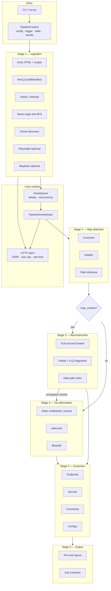

# De-Caffeinator

**JavaScript reverse engineering and asset analysis for authorized security audits.**

De-Caffeinator (package: `blob-unpacker`) crawls a target site, recovers every JavaScript asset it can find, reconstructs sources from maps when available, statically unpacks and de-obfuscates bundles, then extracts endpoints, secrets, comments, and configs into a clean per-host report.

```text
  Target URL
      │
      ▼
 ┌────────────┐    ┌──────────────┐    ┌────────────────┐
 │  Ingest JS │───▶│ Detect maps  │───▶│ Reconstruct or │
 │  (crawl)   │    │  (.map)      │    │ de-obfuscate   │
 └────────────┘    └──────────────┘    └───────┬────────┘
                                               │
                                               ▼
                                    ┌────────────────────┐
                                    │ Extract artifacts  │
                                    │ endpoints · secrets│
                                    │ comments · configs │
                                    └─────────┬──────────┘
                                              │
                                              ▼
                                    ┌────────────────────┐
                                    │ Per-host output    │
                                    │ + Zod contracts    │
                                    └────────────────────┘
```

---

## Table of Contents

- [Features](#features)
- [Quick Start](#quick-start)
- [Installation](#installation)
- [Usage](#usage)
- [Architecture](#architecture)
- [Security Hardening](#security-hardening)
- [Output Structure](#output-structure)
- [Extraction Capabilities](#extraction-capabilities)
- [Project Structure](#project-structure)
- [Tech Stack](#tech-stack)
- [Testing](#testing)
- [Known Limitations](#known-limitations)
- [Contributing](#contributing)
- [License](#license)

---

## Features

| Area | What you get |
|------|----------------|
| **Discovery** | HTML scripts, same-origin BFS crawl, Webpack/Vite chunks, Next.js `_buildManifest`, optional Playwright SPA intercepts, optional Wayback CDX |
| **Source maps** | Comment / header / path inference; full & partial reconstruction; index-map merge with remapped VLQ indices |
| **De-obfuscation** | Static packer unwrap (no `node:vm`), then `webcrack` (unbundle / deobfuscate / unminify), beautify, progress-gated recursion |
| **Extraction** | Endpoints, secrets (entropy + prefix heuristics), AST comments, env/config blocks; custom regex patterns supported |
| **Output** | Per-hostname dirs, first-party vs third-party split, `secrets.json`, Zod-validated contracts |
| **Safety** | SSRF guards, response size caps, path containment, serialized state, validated CLI numbers |

---

## Quick Start

```bash
git clone https://github.com/addydude/De-Caffeinator.git
cd De-Caffeinator/blob-unpacker

npm install

# Scan a target (http/https only)
npx ts-node src/index.ts https://example.com

# Or via the Python launcher
python run.py https://example.com --quick
```

Presets: `--quick` · `--stealth` · `--deep`

---

## Installation

**Prerequisites**

- Node.js >= 18
- npm >= 9
- Python >= 3.8 (optional — `run.py` launcher)
- Playwright browsers only if you use `--playwright` (`npx playwright install chromium`)

```bash
cd blob-unpacker
npm install
```

---

## Usage

### CLI

```bash
npx ts-node src/index.ts <url> [options]
```

### Options

| Flag | Short | Default | Description |
|------|-------|---------|-------------|
| `--output <dir>` | `-o` | `./output` | Output root |
| `--format <fmt>` | `-f` | `json` | `json` or `jsonl` |
| `--depth <n>` | `-d` | `2` | Max link-follow depth |
| `--pages <n>` | `-p` | `50` | Max pages to crawl |
| `--concurrency <n>` | `-c` | `5` | Max concurrent fetches (clamped ≥ 1) |
| `--timeout <ms>` | `-t` | `15000` | Per-request timeout |
| `--delay <ms>` | | `300` | Per-host politeness delay |
| `--deobf-depth <n>` | | `5` | Max Stage 4 recursion passes |
| `--entropy <n>` | | `4.5` | Min Shannon entropy for secrets |
| `--playwright` | | off | Headless SPA / network intercept crawl |
| `--pw-browser` | | `chromium` | `chromium` \| `firefox` \| `webkit` |
| `--wayback` | | off | Wayback Machine CDX discovery |
| `--no-chunks` | | | Disable dynamic chunk discovery |
| `--no-files` | | | Skip writing source / deobfuscated files |
| `--user-agent <str>` | | | Custom User-Agent |
| `--quick` / `--stealth` / `--deep` | | | Scan profiles |

### Python launcher

```bash
python run.py https://example.com --deep --playwright
```

On Windows the launcher runs `npx.cmd` with `shell=False` (no `cmd.exe` interpolation).

---

## Architecture

### System overview



### Per-asset data flow

```text
                    ┌─────────────────────────────────────────┐
                    │              AssetRecord                 │
                    │  url · hash · raw_content · headers     │
                    └──────────────────┬──────────────────────┘
                                       │
                         ┌─────────────▼─────────────┐
                         │     Stage 2: detectMap     │
                         │  comment → header → infer  │
                         │  (requires map_content)    │
                         └──────┬──────────────┬──────┘
                                │              │
                         map ok │              │ no map
                                ▼              ▼
                    ┌──────────────────┐  ┌──────────────────┐
                    │ Stage 3          │  │ Stage 4          │
                    │ parse · VLQ      │  │ static unpack →  │
                    │ full / partial   │  │ webcrack →       │
                    │ sanitize paths   │  │ beautify         │
                    └────────┬─────────┘  └────────┬─────────┘
                             │   unmapped chunks   │
                             └──────────┬──────────┘
                                        ▼
                         ┌──────────────────────────┐
                         │ Stage 5: regex + AST     │
                         │ endpoints · secrets · …  │
                         └────────────┬─────────────┘
                                      ▼
                         ┌──────────────────────────┐
                         │ Stage 6: writeOutputs    │
                         │ + deobfuscated / sources │
                         └──────────────────────────┘
```

### Core components

| Component | Role |
|-----------|------|
| **`PipelineContext`** | Frozen config (validated/clamped), structured logger, atomic state file, results store |
| **`AssetQueue`** | URL/hash dedup, concurrency gate, priority dequeue |
| **`PipelineOrchestrator`** | Branch Stage 3 vs 4, progress-gated Stage 4 recursion, isolation on asset failure |
| **`lib/http`** | Manual redirects, private-IP / DNS SSRF checks, body byte cap, per-host rate mutex |
| **`lib/safe-path`** | Source-map path sanitization + separator-safe containment checks |

### Stage details

#### Stage 1 — Ingestion

Discovers and downloads JS with same-origin discipline:

1. Entry HTML (`<script src>` + inline)
2. Next.js `_buildManifest` (same-origin `/_next/` only)
3. `robots.txt` / `sitemap.xml` (same-origin sitemaps only)
4. Link follower BFS (re-checks origin **after** redirects)
5. Chunk discovery (capped speculative fetches)
6. Optional Playwright (target-host filter; `--no-sandbox` only in CI/containers)
7. Optional Wayback CDX (final host must match target)

Assets are SHA-256 deduplicated before entering the queue.

#### Stage 2 — Source map detection

Priority: comment → `SourceMap` / `X-SourceMap` header → path inference (JSON-validated GET fallback).

Stage 3 runs **only** when `map_content` was successfully fetched — a map URL alone is not enough.

#### Stage 3 — Source reconstruction

- **Full** — `sourcesContent` present
- **Partial** — mixed content + VLQ fragments + name annotations
- **Paths only** — structure recorded; minified body goes to Stage 4

All write paths go through `sanitizeSourcePath` + `isPathInside` (blocks `abc` / `abc_evil` prefix bypass). Index maps remapped source/name indices when merging sections.

#### Stage 4 — De-obfuscation

1. **Static** unwrap: Dean Edwards packer, `eval(atob)`, `unescape`, `new Function` body extract — **never** `node:vm`
2. **`webcrack`** — unpack / deobfuscate / unminify
3. **Beautify** (without unescaping strings before extraction)
4. Recurse only if still packed **and** code size or techniques show progress

`eval_sandbox: false` skips packer unwrap.

#### Stage 5 — Artifact extraction

Regex + Acorn AST. Optional custom `endpoint_patterns` / `secret_patterns` from config. Secrets are masked in output.

#### Stage 6 — Output

Per-target host folder, third-party nesting, Zod-validated `endpoints-contract.json` / `artifacts-contract.json`, human `summary.md`.

---

## Security Hardening

Built for scanning **untrusted** frontends on the operator machine:

| Control | Behavior |
|---------|----------|
| **SSRF** | `http`/`https` only; block private/reserved IPs (incl. metadata `169.254.169.254`); DNS resolve check; manual redirect re-validation |
| **DoS** | Max response body size (default 10 MiB); VLQ/mappings size caps; chunk fetch budget |
| **Path traversal** | Sanitize map `sources[]`; contain writes under `sources/<hash>/` |
| **Code execution** | No `node:vm` for packers; static substitution only |
| **Crawl escape** | Same-origin enforced after redirects (pages, sitemaps, Playwright) |
| **Output** | Secrets masked; short secrets fully redacted |
| **Config** | Numeric options validated; `max_concurrent` cannot be `0`/`NaN` |

Always obtain authorization before scanning systems you do not own.

---

## Output Structure

```text
output/
├── index.json                      # Global multi-host summary (if used)
└── <hostname>/
    ├── deobfuscated/               # Beautified / unpacked first-party JS
    ├── raw/                        # Original downloads
    ├── sources/<hash>/             # Source-map reconstructed tree
    ├── third-party/<cdn-host>/     # Vendor assets
    │   ├── deobfuscated/
    │   ├── raw/
    │   └── sources/
    ├── manifests/
    │   ├── endpoints-contract.json # Zod-validated
    │   └── artifacts-contract.json
    ├── endpoints.json
    ├── secrets.json                # Masked values
    ├── comments.json
    ├── configs.json
    ├── artifact-index.json
    ├── run-report.json
    ├── summary.md
    └── .pipeline-state.json        # Resumability (atomic writes)
```

---

## Extraction Capabilities

### Endpoints

`fetch` / `axios` / jQuery / XHR `.open` (method + URL), route literals, WebSockets. Classified as `public` · `internal` · `hidden`.

### Secrets

AWS / Stripe / GitHub / Slack / Twilio SID shape / JWT three-segment / PEM blocks / DB URLs / high-entropy assignments — with alphabet and encoding-context filters.

### Comments

Real AST comments only (`TODO`, `FIXME`, `HACK`, bypass/debug markers) — not minified noise.

### Configs

`process.env.*`, `import.meta.env.*`, brace-balanced `firebaseConfig` / Sentry / Amplify-style objects, feature flags.

---

## Project Structure

```text
blob-unpacker/
├── run.py                          # CLI launcher (shell=False)
├── package.json
├── tsconfig.json
└── src/
    ├── index.ts                    # Commander CLI + interactive mode
    ├── core/
    │   ├── context.ts              # Config, logger, state, results
    │   ├── pipeline.ts             # Orchestrator + branching
    │   └── queue.ts                # Dedup + concurrency
    ├── lib/
    │   ├── http.ts                 # SSRF-aware fetch
    │   ├── safe-path.ts            # Path sanitization
    │   ├── paths.ts                # First-/third-party layout
    │   ├── hasher.ts
    │   ├── html-entities.ts
    │   └── line-index.ts
    ├── stages/
    │   ├── 1-ingestion/            # Crawl, chunks, Playwright, Wayback
    │   ├── 2-map-detection/        # Comment, header, path infer
    │   ├── 3-reconstruction/       # Maps, VLQ, writers
    │   ├── 4-deobfuscation/        # Static unpack + webcrack
    │   ├── 5-extraction/           # Endpoints, secrets, comments, configs
    │   └── 6-output/               # Writers + Zod schemas
    ├── types/contracts.ts
    └── tests/security-helpers.test.ts
```

---

## Tech Stack

| Layer | Choice |
|-------|--------|
| Runtime | Node.js / TypeScript |
| CLI | Commander |
| HTTP | Native `fetch` (manual redirects) |
| AST | `acorn` + `acorn-walk` |
| De-obfuscation | `webcrack` + static unpackers |
| Beautify | `js-beautify` |
| Validation | `zod` |
| Browser (optional) | Playwright |
| Launcher | Python 3 |

---

## Testing

```bash
cd blob-unpacker
npm test          # security helper suite
npx tsc --noEmit  # typecheck
```

Coverage includes private-IP detection, path containment, static unpack, first-party host heuristics, and index-map merge.

---

## Known Limitations

1. **Playwright cost** — Optional; higher memory/time. Off by default.
2. **Secret false positives** — Tunable via `--entropy`; heuristics reduce noise but cannot eliminate it.
3. **No auth** — Login-walled apps are not crawled unless assets are public.
4. **webcrack** — Third-party engine; treat hostile samples accordingly.
5. **Static packer coverage** — Unusual packer shapes may not unwrap; recursion stops without progress.

---

## Contributing

1. Fork and branch from `main`
2. Keep changes scoped; match existing stage boundaries
3. Run `npm test` and `npx tsc --noEmit`
4. Open a PR with a short “why” summary

---

## License

For educational and **authorized** security testing only. Obtain permission before scanning websites you do not own.
